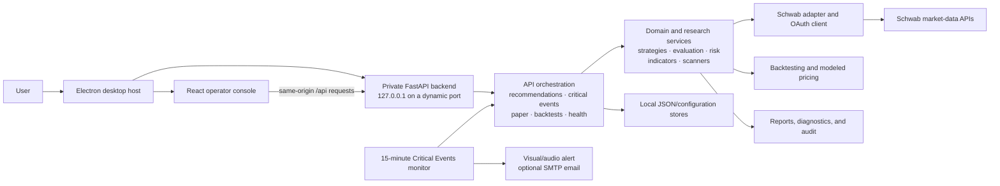

# Options Trading Engine: Living System Overview

> **Purpose:** This is the canonical, maintained description of what the Options Trading Engine does, how it is assembled, where it stores state, and which capabilities are safe to rely on.
>
> **Last verified against the codebase:** 2026-08-19
> **Application version:** 0.9.3 release candidate
> **Current safety mode:** Research and paper simulation only; live broker orders are disabled.

## 1. Product summary

The Options Trading Engine is a local Windows desktop workstation for researching options opportunities. The Recommendations workspace organizes its implemented strategies into two families: directional Credit Spreads (bull put and bear call) and an experimental, direction-neutral Long Straddle strategy driven by the Critical Events signal model.

The application combines:

- live Schwab equity history, quotes, and option chains;
- explainable recommendation and diagnostic pipelines;
- historical, modeled backtesting;
- persistent paper-trading records and live marking;
- direction-neutral Long Straddle research and Critical Events monitoring;
- local operational health, history, logging, and configuration;
- a packaged Electron desktop interface that starts its own private Python service.

The engine does **not** submit, modify, or cancel live Schwab orders.

## 2. Capability map

Status labels used here:

- **Operational:** implemented in the desktop application and covered by tests.
- **Research:** implemented, but its trading value has not been validated sufficiently for production decisions.
- **Partial:** useful components exist, but the complete intended workflow is unfinished.
- **CLI/library:** implemented in Python but not fully exposed in the desktop UI.
- **Unavailable:** intentionally absent or represented by a UI placeholder.

| Area | Status | Current functionality |
|---|---|---|
| Windows desktop application | Operational | Electron launches the private FastAPI backend, waits for readiness, serves the React interface, and stops the backend when the application closes. Installer, portable, and unpacked builds are produced. |
| Command Center | Operational | Displays application health, broker/configuration status, operating mode, latest recommendation scan, paper status, and safety notices. |
| Schwab connectivity | Operational | Local OAuth credentials, token-age detection, in-app reconnection, live market-history requests, quotes, and option-chain retrieval. Schwab refresh credentials require periodic reauthorization. |
| Directional credit-spread recommendations | Operational/Research | Independently scans bullish bull put and bearish bear call candidates, scores and ranks them, returns TRADE/WATCH/PASS decisions, and exposes strategy-specific rejection and pipeline diagnostics. |
| Recommendation profiles | Operational | Saves, loads, renames, duplicates, deletes, and selects default symbol/constraint profiles. |
| Recommendation history | Operational | Persists the latest 100 scans locally and reloads prior results in the desktop UI. |
| Quote audit | Operational | Compares scoring credit with Schwab-derived natural and midpoint credits and flags material differences for review. |
| Paper trading | Operational/Partial | Initializes a simulated account, creates eligible spread positions, preserves entry context, refreshes live marks, records observations and snapshots, and closes positions with realized P/L. Further adjustment/roll guidance and extended soak validation remain. |
| Backtesting | Operational/Research | Runs historical simulations and reports performance, regimes, exit reasons, drawdown, and recent trades. Option prices are modeled estimates rather than reconstructed historical fills. |
| Optimization | CLI/library | Parameter optimization and reporting components exist; the desktop navigation entry is currently a placeholder. |
| Walk-forward analysis | CLI/library | Walk-forward research components and reports exist; the desktop navigation entry is currently a placeholder. |
| Portfolio research | CLI/library/Partial | Portfolio backtesting and constraints exist; live account synchronization and the desktop Portfolio page are not complete. |
| Long Straddle / Critical Events scan | Operational/Experimental | Lives under Recommendations, scans SPY, QQQ, IWM, and DIA for executable 21–45 DTE nearby-ATM straddles, and estimates whether historically forecast movement pays for the displayed two-leg ask debit plus estimated commissions. |
| Long Straddle / Critical Events monitor | Operational/Experimental | Lives under Recommendations, runs every 15 minutes during regular U.S. market hours, requires two consecutive high-confidence scans, deduplicates contract alerts, and emits desktop visual/audio alerts. Optional SMTP email is supported. |
| Long Straddle historical validation | Operational/Research | Runs a look-ahead-safe daily proxy backtest over 2–20 years, reports 1/3/5/10/20-session movement and modeled P/L, calibrates results by a distinct 0–6 historical score, and reserves the final 30% as a chronological holdout. |
| Critical Events quote archive | Operational/Accumulating | Stores evaluated option pairs and continuing tracked-contract quotes in a bounded local SQLite database, deduplicated to one symbol snapshot per 15-minute bucket. Default retention is 730 days with a 1 GB hard logical cap. |
| Scheduling, watchlists, daily reports | CLI/library | Persistent scheduler, named watchlists, and daily recommendation workflows exist in Python. They are not yet complete desktop workflows. |
| Operations and resilience | Partial | Health checks, logging, audit, retry, locking, checkpoints, diagnostics, and deployment helpers exist. Full integration and adverse-condition testing remain active work. |
| Dry-run order preview | Planned | Required before live trading; not currently available through the desktop application. |
| Live trading | Unavailable | No broker order-submission route is exposed. The Live Trading page is a placeholder and the system defaults to read-only/simulation modes. |

## 3. Runtime architecture



### Desktop process ownership

1. `operator-console/electron/main.cjs` acquires the single-instance lock.
2. Electron discovers the repository workspace or creates a standalone writable workspace.
3. It allocates an available loopback port.
4. It starts the packaged `tradingengine-backend.exe` without a terminal window.
5. The backend serves both the compiled React UI and `/api` routes.
6. Electron opens the window after `/api/version` confirms readiness.
7. Closing the application terminates the backend and its in-process monitor.

The backend listens only on `127.0.0.1`; it is not designed as a network-accessible multi-user service.

## 4. Major code areas

| Path | Responsibility |
|---|---|
| `operator-console/src` | React/TypeScript desktop user interface. |
| `operator-console/electron` | Electron lifecycle, window ownership, backend process startup, and shutdown. |
| `app/api` | FastAPI endpoints and UI-facing request/response orchestration. |
| `app/brokers` | Schwab OAuth, connection status, quotes, history, and option-chain access. |
| `app/data` | Translation of external Schwab payloads into internal option models. |
| `app/models` | Market, trade, and portfolio domain models. |
| `app/indicators` | Moving averages, technical measures, trend analysis, and market regime. |
| `app/selection`, `app/options`, `app/strategies` | Contract filtering and spread construction. |
| `app/evaluation` | Candidate scoring, probability, expected value, decisions, ranking, and diagnostics. |
| `app/scanners` | Live recommendation and Critical Events scan orchestration. |
| `app/monitoring` | Long-running Critical Events confirmation and alert logic. |
| `app/paper` | Paper account models, ledger persistence, lifecycle service, marks, and exports. |
| `app/backtesting` | Modeled trade simulation, calibration, optimization, portfolio testing, and walk-forward research. |
| `app/risk` | Portfolio and per-trade constraints. |
| `app/daily`, `app/watchlists`, `app/scheduling` | Multi-symbol workflows, named universes, and scheduled operations. |
| `app/operations` | Health, logging, metrics, retries, locks, audit, recovery, and deployment checks. |
| `app/reports` | Human-readable and machine-exportable research outputs. |
| `tests` | Python unit, integration, API, lifecycle, and safety tests. |
| `packaging` | Windows build and packaging automation. |

## 5. Primary workflows

### 5.1 Credit Spread recommendation workflow

```mermaid
flowchart LR
    History["Daily price history"] --> Analysis["Trend and regime analysis"]
    Chain["Schwab option chain"] --> Normalize["Normalize contracts"]
    Analysis --> Filter["Apply bullish or bearish trend context"]
    Normalize --> Filter
    Filter --> Select["Filter eligible short puts or calls"]
    Select --> Pair["Pair fixed-width protective options"]
    Pair --> Risk["Credit, liquidity, and risk gates"]
    Risk --> Evaluate["Probability, EV, score, decision"]
    Evaluate --> Rank["Rank candidates"]
    Rank --> UI["Recommendations, diagnostics, history"]
    UI --> Paper["Optional local paper position"]
```



The Bull Put defaults currently include:

- underlying trend: price above the 200-day SMA and 20-day SMA above the 200-day SMA;
- expiration: 30–45 DTE;
- short-put absolute delta: 0.15–0.25;
- short-put minimum bid: $0.20;
- short-leg minimum open interest: 100;
- short-leg minimum volume: 10 during regular market hours;
- short-leg quote width: no more than 25% of the option midpoint, with a $0.10 minimum allowance;
- fixed long-put widths: $3, $5, or $10 below the short put;
- no separate delta requirement for the long hedge leg;
- protective-leg minimum open interest: 25, with no daily-volume minimum;
- protective-leg quote width: no more than 50% of midpoint, with a $0.10 minimum allowance;
- minimum spread credit: $0.50;
- minimum TRADE score: 75;
- minimum managed expected value: $0;
- maximum modeled risk per trade: $500.

The Bear Call defaults use the same 30–45 DTE, short-leg absolute delta, liquidity, minimum-credit, scoring, and risk framework, with these directional differences:

- bearish trend alignment: price below the 200-day SMA and 20-day SMA below the 200-day SMA;
- sell the lower-strike call and buy a protective higher-strike call;
- fixed protective-call widths: $2, $3, or $5 above the short call;
- no separate delta requirement for the protective long call;
- bullish regimes are treated as unfavorable rather than bearish regimes.

The two strategies are evaluated independently. A failed bull put does not automatically qualify a bear call, and the UI can scan Bull Put, Bear Call, or Both.

Outside the regular 9:30 a.m.–4:00 p.m. Eastern weekday window, current-session option volume is not used as a hard baseline gate because it may be zero or stale. These scans are labeled provisional in the API and UI and should be rerun during regular market hours before relying on executable prices. An explicit user-supplied per-leg volume constraint remains enforceable after candidate construction.

The Recommendations page can override many of these constraints without modifying source code. A result is a research classification—not an instruction to place a live order.

### 5.2 Paper-trading workflow

The desktop workflow is:

1. Run or load a recommendation scan.
2. Review strategy, direction, decision, rationale, risk, quote audit, and constraints.
3. Create a local simulated position. PASS decisions are blocked; WATCH requires explicit experimental labeling.
4. Refresh the spread mark from live Schwab option quotes or enter a deliberate manual mark.
5. Record observations, account snapshots, and position state.
6. Close the simulated position with an exit debit and reason.
7. Review realized/unrealized P/L and journal context after application restarts.

Paper actions write only to the local ledger. They do not create Schwab orders.

### 5.3 Long Straddle / Critical Events workflow

The Long Straddle strategy uses the Critical Events signal model to separate **arrival** from **direction**: first identify conditions in which a large excursion may be more likely than the option premium implies; only then consider how the move might be expressed. The direction-neutral live benchmark is a matching ATM call and put—an ATM straddle.

For each supported ETF, the scanner:

1. loads at least 61 daily candles, 45 calendar days of regular-hours 15-minute candles, and a full Schwab option chain;
2. evaluates up to three same-strike call/put pairs within 1.5% of spot across the four expirations nearest 32 DTE, constrained to 21–45 DTE;
3. rejects pairs that fail quote, open-interest, regular-hours volume, freshness, or combined-spread gates;
4. estimates the expiration payoff distribution from a 65/35 blend of 20- and 60-session realized volatility;
5. compares expected payoff with the displayed two-leg natural ask debit plus $3 estimated commissions per spread, without an additional fill-probability or percentage-slippage penalty;
6. scores compression, modeled option value, same-time intraday pressure, ignition, and liquidity on a true 10-point scale.

Current scoring thresholds:

| Component | 2 points | 1 point | 0 points / limitation |
|---|---|---|---|
| Compression | Five-session normalized range `< 0.65×` baseline | `< 0.85×` | Otherwise |
| Option value | Modeled expiration return `≥ 10%` after displayed asks and commissions | `≥ 0%` | Negative modeled return |
| Pressure | Latest completed 15-minute volume `> 1.8×` the same time-of-day baseline | `> 1.2×` | Otherwise |
| Ignition | 20-session breakout and same-time range expansion `> 1.6×` | Either breakout or expansion `> 1.3×` | Otherwise |
| Liquidity | Combined leg spread `≤ 5%` of straddle midpoint | `≤ 10%` | Otherwise |

Hard execution-quality gates require at least 100 open interest per leg, at least 10 current-session contracts per leg during regular hours, a bid of at least $0.05, non-crossed quotes, and a combined quote width no greater than 15% of the straddle midpoint. During regular hours both leg quotes must be present and no more than 20 minutes old. Volume and quote-freshness gates are relaxed outside regular hours, and the result is labeled provisional.

The event calendar is deliberately reported as `NOT_INTEGRATED` and contributes no points. Market implied volatility is shown as context but does not independently create an option-value score; the score is based on modeled payoff versus the displayed ask debit plus commissions. Quote freshness and width remain data-quality gates, but the engine does not model order-book fill probability.

A monitor alert requires all of the following:

- score at least 8/10;
- phase `IGNITION`;
- 2/2 for option value, ignition, and liquidity;
- the condition appearing in two consecutive monitor scans;
- no prior alert for the same ETF/expiration/strike during the current backend session.

Both consecutive observations must refer to the same ETF, expiration, and strike; a changing contract cannot inherit another contract's confirmation streak.

### 5.4 Long Straddle historical validation and quote collection

The Historical Validation & Data subview separates what can be tested now from what must be accumulated prospectively.

The immediate backtest:

1. loads 2–20 years of daily Schwab history for SPY, QQQ, IWM, and DIA;
2. computes compression, daily-volume pressure, and daily-range/breakout ignition using only information available on each observation date;
3. uses a separate 0–6 daily proxy score because historical daily candles cannot reproduce the live intraday and executable-liquidity components;
4. models an ATM 32-DTE straddle with Black-Scholes, the live 20/60 realized-volatility blend, a configurable implied-volatility markup, and commissions;
5. measures absolute return, maximum excursion, breakeven attainment, and modeled P/L after 1, 3, 5, 10, and 20 sessions;
6. reports results by score and keeps the chronologically latest 30% as an unseen holdout.

Because historical option quotes are unavailable, the backtest reports three fixed top-of-book cost sensitivities: no spread allowance, $0.02 per leg, and $0.05 per leg; commissions apply in every case. Daily observations can overlap across forward horizons, and historical option prices remain modeled rather than reconstructed. Results therefore validate the movement thesis and the robustness of modeled economics across small execution-cost assumptions.

Every live or monitored Critical Events scan also builds a prospective quote archive. To control storage, it stores only contracts actually evaluated by the scanner and continues following those contract symbols on subsequent scans. Feature payloads are compressed; quotes are normalized in SQLite for replay. Duplicate scans within the same 15-minute symbol bucket are ignored. Age retention and the size cap are both enforced automatically.

The monitor runs only while the desktop application is open. Its default interval is 15 minutes, and outside 9:30 a.m.–4:00 p.m. Eastern on weekdays it reports `WAITING_FOR_MARKET`. These are experimental research signals, not validated trade recommendations.

## 6. API surface

The desktop UI uses a private same-origin API. Major route groups are:

| Route group | Purpose |
|---|---|
| `/api/version`, `/api/health`, `/api/dashboard` | Runtime status and Command Center data. |
| `/api/schwab/status`, `/api/schwab/authorize*` | Connection status and in-app reauthorization. |
| `/api/recommendations/scan` | Live constrained bull put scan. |
| `/api/recommendations/history*` | Saved scan summaries and full historical results. |
| `/api/trading-profiles*` | Saved recommendation criteria. |
| `/api/backtests` | Modeled historical strategy simulation. |
| `/api/paper/*` | Simulated account, positions, marks, live refresh, closes, and snapshots. |
| `/api/critical-events/scan` | On-demand Critical Events scan. |
| `/api/critical-events/monitor*` | Monitor status, start, and stop. |
| `/api/critical-events/backtest` | Look-ahead-safe daily proxy validation and modeled Long Straddle outcomes. |
| `/api/critical-events/archive` | Quote-archive size, retention, coverage, and annualized run-rate status. |

There is intentionally no route for live order submission or order placement.

## 7. Local state and configuration

| Location | Contents | Git policy |
|---|---|---|
| `.env` | Schwab application credentials, callback settings, and optional SMTP settings. | Never commit. |
| `token.json` | Local Schwab OAuth access and refresh state. | Never commit. |
| `config/` | Strategy, watchlist, trading-profile, and runtime configuration. | Commit defaults; review user-specific files before committing. |
| `data/recommendation_scan_history.json` | Up to 100 saved recommendation scans. | Runtime data; normally excluded. |
| `data/paper_account.json` | Persistent paper account, positions, observations, and snapshots. | Runtime data; normally excluded. |
| `data/critical_event_archive.sqlite3` | Bounded evaluated-contract quotes and compressed Critical Events feature snapshots for future replay. | Runtime data; excluded. |
| `logs/` | Runtime and operational logs. | Runtime data; excluded. |
| `reports/` | Generated research and trading reports. | Generated data; normally excluded. |
| Electron user-data workspace | Standalone-install configuration and writable state when no repository workspace is found. | Outside the repository. |

Optional Critical Events email alerts use:

- `CRITICAL_EVENT_SMTP_HOST`
- `CRITICAL_EVENT_SMTP_PORT`
- `CRITICAL_EVENT_SMTP_USERNAME`
- `CRITICAL_EVENT_SMTP_PASSWORD`
- `CRITICAL_EVENT_SMTP_STARTTLS`
- `CRITICAL_EVENT_EMAIL_FROM`
- `CRITICAL_EVENT_EMAIL_TO`

Critical Events archive controls use:

- `CRITICAL_EVENT_ARCHIVE_ENABLED` (default `1`)
- `CRITICAL_EVENT_ARCHIVE_PATH` (default `data/critical_event_archive.sqlite3`)
- `CRITICAL_EVENT_ARCHIVE_INTERVAL_MINUTES` (default `15`)
- `CRITICAL_EVENT_ARCHIVE_RETENTION_DAYS` (default `730`)
- `CRITICAL_EVENT_ARCHIVE_MAX_MIB` (default `1024`)

## 8. Build, test, and release

Developer validation:

```powershell
.\.venv\Scripts\python.exe -m pytest -q
cd operator-console
npm run build
```

Windows packaging from the repository root:

```powershell
powershell -ExecutionPolicy Bypass -File .\packaging\build_desktop.ps1
```

Artifacts are written to `operator-console/release`:

- `TradingEngine-0.9.3-x64-Setup.exe`
- `TradingEngine-0.9.3-x64-Portable.exe`
- `win-unpacked/TradingEngine.exe`

The current source build was validated with 241 passing Python tests, a successful TypeScript/Vite production build, a live four-ETF Critical Events scan, and a live five-year/four-ETF historical validation on 2026-08-20. Refreshed Windows artifacts are recorded after each applicable release build.

## 9. Safety invariants

These rules describe the current trust boundary and must remain true unless a separately reviewed live-trading milestone explicitly changes them:

1. No live broker order is submitted, modified, or cancelled.
2. Paper positions remain explicitly labeled simulation-only.
3. Historical option fills are labeled modeled estimates.
4. Schwab secrets and tokens stay local and outside version control.
5. An expired or rejected Schwab credential produces a reconnect workflow rather than an interactive terminal dependency.
6. PASS recommendations cannot be paper-executed; WATCH simulation requires an explicit experimental choice.
7. The desktop backend binds only to loopback.
8. Critical Events alerts remain labeled unvalidated research signals.

## 10. Known limitations and next priorities

The current priority sequence remains:

1. Complete and soak-test the full paper-trading lifecycle over real market sessions.
2. Measure recommendation outcomes, slippage, score calibration, and behavior by market regime.
3. Harden all Schwab-facing workflows against rate limits, partial data, stale quotes, network loss, token expiry, and process interruption.
4. Add durable migrations, backups, data-freshness warnings, and account-safe desktop settings.
5. Add read-only Schwab account/position reconciliation and exact multi-leg order previews.
6. Add persistent PAPER/DRY_RUN/LIVE modes and a safe-default kill switch.
7. Consider manually approved live submission only after the preceding gates are validated.

Critical Events-specific research gaps include a real event-calendar feed, volatility skew and term-structure modeling, non-normal return distributions, and larger independent samples. A chronological holdout now exists, and prospective top-of-book option quotes are accumulating, but the current expected-value estimate remains a transparent historical-volatility model rather than a validated forecast or trade recommendation.

See [TRADING_ENGINE_COMPLETION_PLAN.md](TRADING_ENGINE_COMPLETION_PLAN.md) for the staged path toward a controlled live pilot.

## 11. How to keep this document living

Update this file in the same change whenever any of the following occurs:

- a top-level desktop capability is added, removed, or materially changed;
- a new external integration or API route is introduced;
- a new persistent store, secret, or environment variable is added;
- a safety invariant changes;
- a placeholder becomes operational;
- a release changes the test count, artifacts, or supported workflow;
- a limitation is resolved or a milestone becomes the active priority.

For each update:

1. change the **Last verified against the codebase** date;
2. update the capability status and relevant workflow;
3. update architecture, storage, API, or safety sections if affected;
4. record the change below;
5. confirm links and commands still work.

Code and automated tests are authoritative when this document and implementation disagree. A disagreement should be treated as documentation debt and corrected in the next change.

### Document change log

| Date | Change |
|---|---|
| 2026-08-21 | Removed the extra 2% Long Straddle execution buffer. Live value now uses displayed asks plus commissions; historical modeled P/L reports zero/$0.02/$0.05-per-leg execution-cost sensitivities instead of asserting one slippage estimate. |
| 2026-08-20 | Added look-ahead-safe Long Straddle historical validation, modeled 1/3/5/10/20-session outcomes, score calibration, a chronological holdout, and a bounded/deduplicated SQLite option-quote archive with visible storage telemetry. |
| 2026-08-19 | Rebuilt Long Straddle scoring around cost-buffered expiration expected value, completed same-time intraday pressure/ignition signals, executable multi-contract selection, live quote quality gates, a true 10-point score, and contract-bound monitor confirmation. |
| 2026-08-17 | Added independently evaluated bear call credit spreads with $2/$3/$5 protective-call widths, dual-strategy recommendations, paper-trading support, and strategy-aware diagnostics. |
| 2026-08-17 | Replaced the rigid baseline quote-width filter with midpoint-relative checks, removed protective-leg daily-volume requirements, reduced protective-leg OI to 25, and labeled off-hours scans provisional. |
| 2026-08-17 | Reorganized Recommendations into Credit Spreads and Long Straddle strategy sub-tabs; Critical Events now serves as the Long Straddle signal model rather than a standalone sidebar destination. |
| 2026-08-16 | Designated this file as the canonical source of truth and reduced older status and architecture documents to focused supplements or compatibility links. |
| 2026-08-16 | Created the living system overview and incorporated the desktop, recommendation, Schwab reconnect, paper-trading, backtesting, and Critical Events architecture. |
